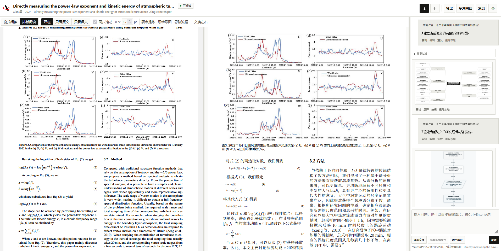
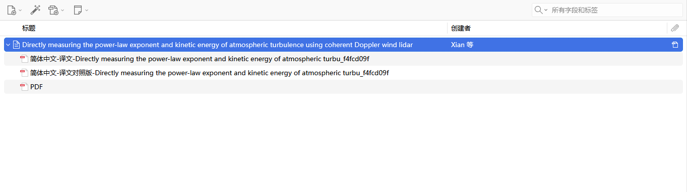
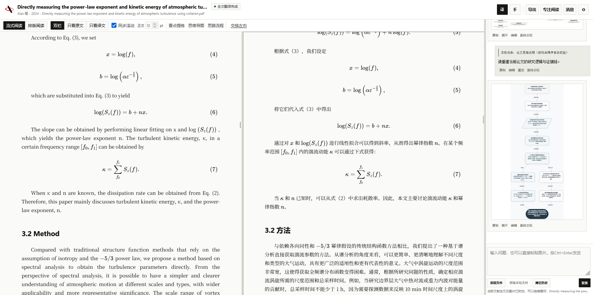
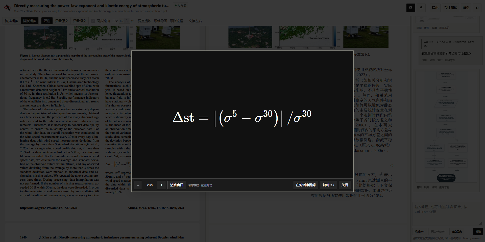
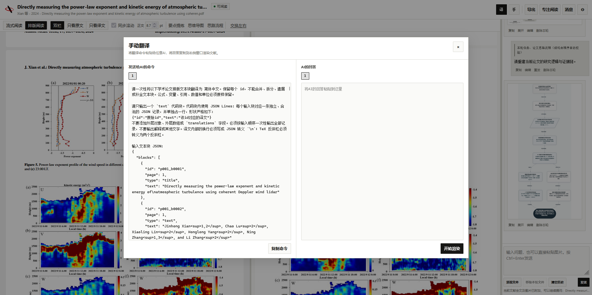
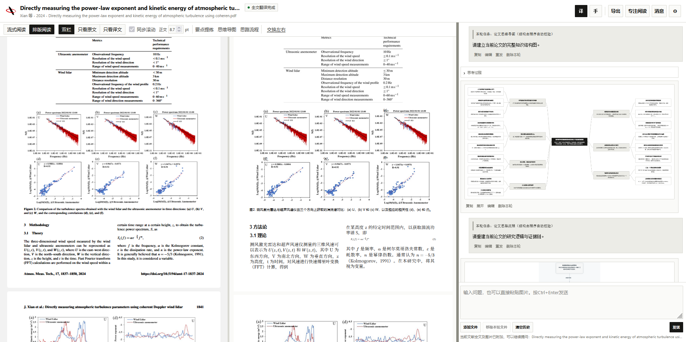
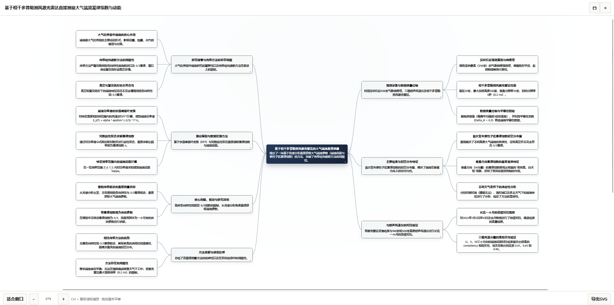
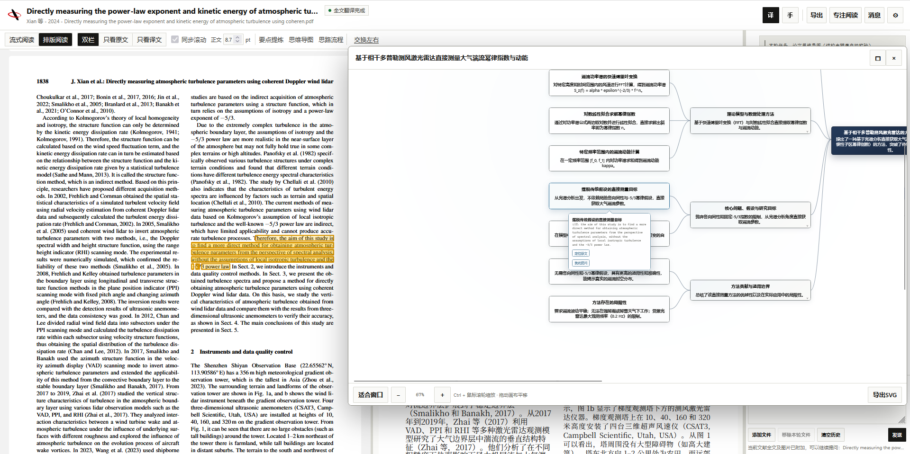
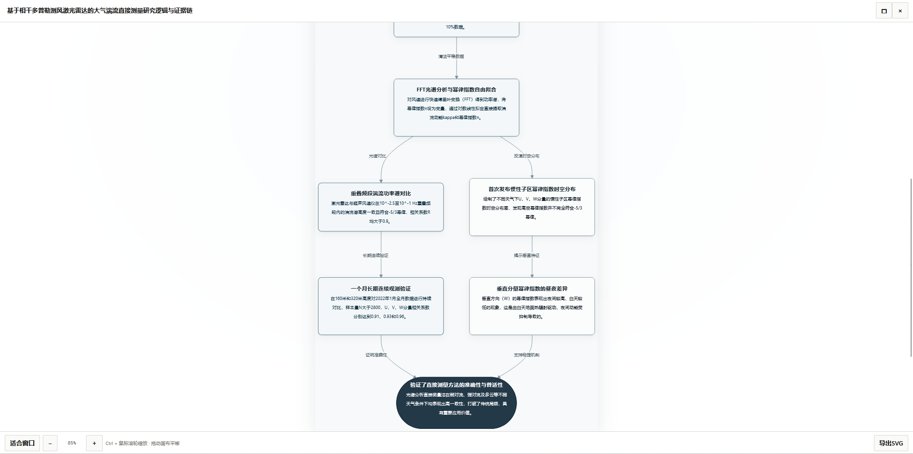
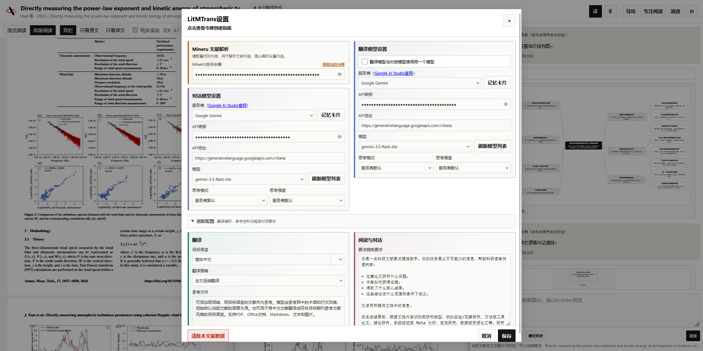

<p align="center">
  
</p>

<h1 align="center">LitMTrans</h1>

<p align="center">
  Zotero中的科研PDF解析、排版翻译与全文AI阅读
</p>

<p align="center">
  <a href="https://github.com/SRT117/LitMTrans-Zotero/releases/latest">下载发行版</a>
  · <a href="#安装">安装</a>
  · <a href="#配置与成本">配置</a>
  · <a href="https://github.com/SRT117/LitMTrans-Zotero/issues">问题反馈</a>
</p>

<p align="center">
  <a href="https://www.zotero.org/"></a>
  <a href="https://github.com/SRT117/LitMTrans-Zotero/releases"></a>
  <a href="https://github.com/SRT117/LitMTrans-Zotero/releases"></a>
  <a href="LICENSE"></a>
</p>

---

LitMTrans是一个Zotero桌面插件，使用MinerU将PDF文献解析后用于翻译和AI对话，因为项目基于视觉解析的Mineru服务，所以对扫描版PDF文献也有强大的支持，可将期刊文献和学位论文PDF翻译为流式格式与排版格式并导出译文PDF。可以在Zotero中直接查看原文与译文、直接复制公式LaTeX、围绕整篇论文提问，也可以生成带原文证据的要点、思维导图和研究流程图。项目插件本身免费，Mineru key需用户自行配置（免费），翻译服务可以选择免费服务或者AI模型服务，其中AI模型服务需要自行配置API key，插件支持多种模型服务商。

> 如需脱离 Zotero 独立运行、或需要导出带有可编辑原生公式（OMML）的 Word 文档，请参考独立桌面客户端：[LitMTrans](https://github.com/SRT117/LitMTrans)。



## 阅读与翻译

### 排版译文

排版模式按照MinerU识别出的栏目、图片、公式、标题和图注重新组织页面，程序依据内部规则进行排版迭代，尝试还原原文的版面结构。阅读时可以使用原文/译文双栏、单栏、同步滚动、左右交换和字号调整。

翻译完成后会生成纯译文PDF和原文/译文对照PDF，并自动挂到当前Zotero条目下。



### 流式译文

这种模式将多栏的文献还原为了适合连续阅读的情形，适合长篇学位论文的阅读和翻译。



### 公式

识别出的数学公式会保留为LaTeX，可以在Zotero中点击公式单独查看并复制TeX。对于数学、物理、工程等公式较多的文献，解析得到的TeX可以直接带到笔记、Markdown或LaTeX写作中。需要注意的是，解析得到的公式可能存在识别误差，需要用户自行核对，不过一般情况下精度还是较高的。



### 模型翻译与参考文献

模型翻译可以设置目标语言和自定义翻译要求，也可以加入参考文献，参考文件经过文本读取或MinerU解析后，以完整文本作为术语、搭配、语体和领域表达的参考。

这在同一课题组、同一期刊或固定研究方向的连续翻译中比较实用：可以把已经认可的论文作为参考，让术语和表达习惯保持一致，同时仍逐篇忠实翻译当前文献。同样的道理，可以把目标期刊的文献作为参考文献，将自己写作的论文翻译成目标语言，结合自定义翻译指令，说不定可以提升外文科研写作翻译效果。

如果不配置模型API，也可以把LitMTrans生成的结构化翻译指令复制到网页端AI，再将AI的回答粘贴回来完成排版渲染，可以说是另类的免费翻译方式，实测DeepSeek网页版可以直接一次性成功翻译整篇期刊文献。



Google/Bing翻译可以直接使用；Windows下还提供Edge本地翻译。
## 全文AI阅读

AI阅读直接建立在MinerU的文档解析结果上，LitMTrans会把当前论文完整的解析Markdown和论文图片加入上下文，支持视觉输入的模型会按图片在正文中的出现顺序收到真实图片，后续问题继续沿用当前会话，也可以把Zotero中选中的文字、公式或图片附加到问题中。

对话还可以额外加入PDF、Office文档、Markdown、文本或图片。文档类附件会先经过解析，再和当前论文一起作为上下文使用。

AI模块会将完整的文献上下文直接提供给AI，不做任何裁切或向量化，实测一篇五百多页的书籍占用大概230k token，AI对话模块默认不对历史消息进行切除，一方面保证了较高的缓存命中，另一方面不会因为连续对话导致初始对话被遗忘，不过这也导致对话上限受制于模型上下文限制，因此请自行把握上下文范围，避免超出模型能力。



### 要点、思维导图与研究流程

工具栏提供针对整篇论文的要点提炼、思维导图和研究流程三个入口。生成图示时，节点可以保存论文原文中的逐字证据，点击节点可以回到Reader中对应位置核对上下文，思维导图节点还可以继续发起提问。在对话过程中提到“思维导图”、“流程图”等关键词，也可以触发AI绘制相应图形的能力。





研究流程图按照论文实际的研究问题、方法、证据、结果和条件关系组织，非常有利于理解文献的研究思路。



### 引用论文中的真实图片

模型回答需要引用图表时，可以返回当前论文中的图片引用。LitMTrans会把引用解析回MinerU提取的本地图片并显示在回答中，因此图像仍来自论文原始内容。这个机制同样适用于用户额外加入的文档。

### 大模型缓存命中

LitMTrans在请求结构中尽量保持全文和历史消息的前缀稳定，把每轮变化的选区和问题放在后部，并为会话维持稳定的缓存标识。支持返回缓存统计的服务会在界面显示输入、输出token和缓存命中率。对于NewAPI的服务，进行了专门的缓存命中优化，相比市面上常见的AI聊天软件，LitMTrans的缓存命中率有显著提升。

这项处理也用于模型翻译，DeepSeek官方接口的快速排版翻译会先用少量请求确认长上下文缓存已经稳定，再释放后续并发，如果缓存没有达到保护条件，剩余批次不会继续发送，避免在长论文上重复产生未命中的输入费用。

## 适用的文献

### 常规电子论文、图片型PDF、扫描件与历史文献

扫描版、早期数字化文献和文字层损坏的PDF往往没有可靠的字符编码或阅读顺序，LitMTrans使用MinerU的识别结果进行翻译和排版，因此原文件不需要先具备可用的文字层，常规电子论文、图片型PDF、扫描件与历史文献都可以直接解析和翻译。

效果仍取决于扫描清晰度和MinerU的识别结果，模糊文字、复杂表格或公式识别错误会进入后续翻译和排版，使用时应以原文为准核对关键内容。

### 公式密集的论文

公式在解析后保留为可复制的TeX，并在译文中重新渲染。这样处理对公式较多的学科比较方便，也适用于原PDF公式字符无法直接读取的情况。公式字体和局部间距可能与原稿不同，识别正确性仍由MinerU的解析结果决定。

### 长PDF

当文件超过MinerU当前接口允许的单文件范围时，LitMTrans会在本地分段提交，再合并页码、图片和版面结果。这套流程已经在500余页的工程软件用户手册上完成过完整的解析、翻译和译文PDF生成测试，这里的测试只说明目前处理过的文档规模，不代表固定的页数上限。另外，长文档建议使用分块翻译模式，避免因为上下文过长导致翻译模型后续智能水平持续降低导致翻译失真。

带权限加密且无法安全拆分的文件可能无法使用这一流程。MinerU的接口限制会随服务更新，具体以官方文档为准。

---

## 安装

### Zotero 中文社区插件商店

[Zotero 中文社区插件商店](https://zotero-chinese.com/plugins/)是第三方社区维护的插件目录。LitMTrans 的收录信息以该页面实际显示为准；尚未显示时请使用下方 GitHub Releases 安装。

首次完整使用通常只需要填写两个凭证：一个MinerU Token（免费获取，请访问[MinerU官网](https://mineru.net)），以及一个用于翻译和AI阅读的模型API Key，不填写AI的API Key也可以使用免费翻译服务翻译，不过AI对话模块无法使用。

### GitHub Releases

也可以从[Releases](https://github.com/SRT117/LitMTrans-Zotero/releases/latest)下载最新 `.xpi`：

1. 在Zotero中打开 `工具` → `插件`；
2. 点击右上角齿轮，选择 `从文件安装插件(Install Add-on From File...)`；
3. 选中下载的 `.xpi`，安装完成后重启Zotero。

插件带有更新机制，后续版本由Zotero按用户的更新设置处理。

## 配置与成本

解析、翻译和AI阅读的服务可以分别配置。翻译模型和对话模型可以使用同一个服务，也可以各自选择不同模型。



| 模块 | 需要的凭证 | 用途 |
| --- | --- | --- |
| 文献解析 | MinerU Token | 正文、公式、图片和版面结构提取 |
| 模型翻译 / AI阅读 | 第三方模型API Key | 全文翻译、问答、要点和图示生成 |
| Google/Bing翻译 | 无 | 网络机器翻译 |
| Edge本地翻译 | 无 | Windows本地翻译 |

LitMTrans本身以MIT License开源，没有订阅费用。MinerU官方API当前提供日常解析额度；额度和服务规则可能调整，请以[MinerU官方文档](https://mineru.net/doc/docs/) 为准。

模型费用由所选服务商按实际token用量收取。以作者近期使用DeepSeek API的实际测试为例，一篇常见期刊论文的完整翻译约为 **¥0.07**（2026年8月deepseek官方涨价后成本可能会有较大涨幅）。这个数字只用于说明当前使用量级，不是固定价格：论文长度、模型、输出量、缓存命中率和服务商定价都会影响最终费用。DeepSeek的当前价格见其 [官方定价页面](https://api-docs.deepseek.com/zh-cn/quick_start/pricing)。

如果只需要翻译而不使用模型能力，也可以选择Google/Bing，或在Windows下使用Edge本地翻译，使用手动翻译功能复制网页问答AI的结果也是非常不错的选择。

---

## 实现补充

### 文档解析如何进入AI上下文

当前论文解析完成后会生成结构化Markdown和图片资源。对话的第一轮把完整文档内容作为稳定的文档上下文加入会话；图片在支持视觉输入的模型上按照正文顺序发送，并与Markdown中的图片占位符、图注和上下文对应。模型不支持图片输入时，LitMTrans会保留全文文字并自动省略图片。

Reader选区、用户当前问题和临时引用会追加在稳定的文档与历史消息之后。这种顺序同时服务于上下文缓存：对于按重复前缀计算缓存命中的服务，长论文正文可以在后续请求中保持较高的复用机会。会话还保存稳定的缓存键，并适配部分OpenAI-compatible服务和OpenRouter的缓存/会话路由字段。

AI返回论文图片引用时，LitMTrans会检查来源标签和图片占位符，再解析到当前文档或附加文档中的本地图片。思维导图和研究流程中的证据则保存为原文逐字引用，用于后续定位和核对。

### 排版翻译如何重建页面

MinerU给出正文、标题、图片、公式、图注等元素及其页面位置。LitMTrans会把同一栏内连续的正文组织成可以重新换行的文本流，图片、公式和标题等继续作为独立视觉元素放在对应位置。浏览器完成实际渲染后，程序检查文字溢出和元素碰撞，再调整字号与行距。

生成页面保留的是栏目和主要视觉元素之间的关系。译文可以在栏内重新流动，因此跨语言文本长度变化不会被限制在原文的每一个小文本框里。

### 与pdf2zh / BabelDOC的实现差异

[PDFMathTranslate/pdf2zh](https://github.com/PDFMathTranslate/PDFMathTranslate)和[BabelDOC](https://github.com/funstory-ai/BabelDOC)会直接利用PDF中已有的字符、字体、坐标和绘图对象，在PDF自身的版面信息上恢复段落、公式和样式，再完成译文排字和PDF生成。文字层完整、制作规范的电子PDF中，直接利用原始PDF对象通常更容易保留字体、公式外观和局部位置，pdf2zh等项目对此已经相当成熟。

LitMTrans的起点是MinerU输出的页面结构，译文随后在浏览器布局层重新组织，LitMTrans的正文换行空间更自由，规范的电子PDF、扫描件、文字层异常或字符编码损坏的文献都是同一套处理流程，LitMTrans对扫描件相比其他项目或许有更高的容忍度。不过LitMTrans的最终排版效果受MinerU解析结果的影响，对于不同的文献，可能出现部分字体大小不一的现象，这是因为部分正文被识别为图注等其他类型导致的。

公式也沿用这套结构化路线：MinerU输出的公式内容重新渲染并保留TeX。它不要求原PDF中的公式字符必须可读，但公式外观不追求逐像素复刻，识别错误也会反映在最终结果中。

这些差异主要来自两套方案对PDF信息的取用方式。对版式要求较高的文献，最终结果仍建议逐页核对。

---

## 数据与隐私

LitMTrans没有内置账号体系，也没有遥测和广告模块。插件自身的缓存、翻译状态和会话数据保存在当前Zotero Profile下，不修改源PDF及其所在目录。

使用外部服务时，需要注意对应的数据流向：

- MinerU解析会把待解析文档提交到用户配置的MinerU服务；
- 模型翻译会把需要翻译的文本，以及用户配置的参考语料发送到所选模型服务；
- 全文AI阅读会把解析后的论文正文发送给所选模型；启用视觉输入时还会发送论文图片；
- Google/Bing等网络翻译会把待翻译文本发送到对应服务。

API密钥保存在Zotero的凭据存储中。排版译文和对照PDF作为Zotero附件保存，可以继续使用Zotero的附件管理和同步能力。卸载插件时不会自动删除API密钥和生成数据；需要清理缓存时请参考[PRIVACY.md](PRIVACY.md)。

文献包含敏感、保密或受限内容时，请在调用外部API前确认相应服务商的数据处理政策符合你的使用要求。

## 系统兼容性

- 支持**Zotero 7.0**及更高版本；
- 主要功能已在**Windows 11**上针对Zotero 7/8/9/10做过回归测试，个别测试文献在Zotero 8中出现了字号过大的排版异常，建议使用Zotero 7/9/10；
- **macOS与Linux**：基础功能可用，目前没有做完整回归测试；
- **Edge本地翻译**：受系统组件限制，仅支持Windows；
- **移动端**：Zotero iOS/Android不支持桌面插件。

## 常见问题

### 没有模型API Key能否使用？

可以使用Google/Bing翻译，以及Windows下的Edge本地翻译。排版译文仍需要MinerU完成文档结构解析；模型翻译、全文问答、思维导图和研究流程等功能需要模型API。

### 扫描版PDF可以翻译吗？

可以。扫描件由MinerU完成识别，进入与普通PDF相同的翻译和排版流程，实际效果取决于扫描清晰度和解析结果。

### AI会读取论文图片吗？

如果所选模型支持视觉输入，会。LitMTrans将论文图片按照它们在正文中的位置与文献全文一起加入上下文，非多模态模型会自动使用无图的全文上下文。

### AI回答中的图片来自哪里？

当模型按照文档中的图片引用返回图表时，LitMTrans会解析并显示MinerU提取的本地论文图片。它们来自当前论文或用户附加的文档。

### 公式可以复制吗？

可以。MinerU成功识别的公式可以直接复制为LaTeX，排版译文也使用这份公式内容重新渲染。

### 长PDF怎么处理？

超过MinerU当前单文件限制时，LitMTrans会自动拆分后分别解析，再合并页面和资源。实际测试过500余页的工程软件用户手册，并完成了后续翻译与PDF生成。带权限加密且无法安全拆分的PDF可能无法使用这一流程。

### 译文和生成文件保存在哪里？

解析结果和翻译状态保存在Zotero Profile下。纯译文PDF和对照PDF会作为普通附件挂载到当前Zotero条目。

### 接口调用失败怎么排查？

先检查Base URL、模型名称、API Key和账户状态。如果仍然无法解决，可以在提交Issue时附上脱敏后的错误日志。

### 是否有不依赖 Zotero 的独立桌面版？

有的。如果习惯在独立窗口中阅读文献，或者需要将排版译文导出为带有原生可编辑公式（OMML）的Word文档，可以使用配套的独立桌面端应用：[LitMTrans](https://github.com/SRT117/LitMTrans)。

---

## 源码与开发

构建环境：`Node.js 22.8+`、`npm`、`Python 3`。

```bash
npm ci
npm run validate
npm run build

# Windows
npm run build:windows
```

编译产物位于`dist/`。项目架构和本地测试说明见[ARCHITECTURE.md](ARCHITECTURE.md)与[TESTING.md](docs/TESTING.md)。

---

## 致谢与相关项目

LitMTrans-Zotero 的实现离不开以下开源项目与工具的启发和支持：

- [LitMTrans (Desktop)](https://github.com/SRT117/LitMTrans)：LitMTrans 独立桌面端版本，为插件版提供了核心排版算法与架构基础；
- [MinerU](https://github.com/opendatalab/MinerU)：高质量的文档视觉解析与结构化提取支持；
- [PDFMathTranslate / pdf2zh](https://github.com/PDFMathTranslate/PDFMathTranslate) 与 [BabelDOC](https://github.com/funstory-ai/BabelDOC)：学术文献双语排版翻译的先驱工作与思路启发；
- [KaTeX](https://github.com/KaTeX/KaTeX) 与 [Mermaid](https://github.com/mermaid-js/mermaid)：离线 LaTeX 数学公式与流程图/思维导图渲染支持；
- [Adobe Source Han Serif](https://github.com/adobe-fonts/source-han-serif)：开源思源宋体字体；
- [Zotero](https://www.zotero.org/)：优秀的开源文献管理平台与插件生态。

## 报告问题与参与贡献

- Bug和功能建议：[GitHub Issues](https://github.com/SRT117/LitMTrans-Zotero/issues)
- 开发贡献：[CONTRIBUTING.md](CONTRIBUTING.md)
- 安全问题：请参考[SECURITY.md](SECURITY.md)，通过Private Vulnerability Reporting非公开提交

### 开源信息

- 维护者：[SRT117](https://github.com/SRT117)
- 许可证：[MIT License](LICENSE)
- 第三方组件许可：[THIRD_PARTY_NOTICES.md](THIRD_PARTY_NOTICES.md)
- Bundled / managed third-party components retain their respective licenses; see [THIRD_PARTY_NOTICES.md](THIRD_PARTY_NOTICES.md) and [docs/licensing/](docs/licensing/).

*LitMTrans是独立开源项目，与Zotero、MinerU或相关模型提供商不存在隶属或合作关系。*
